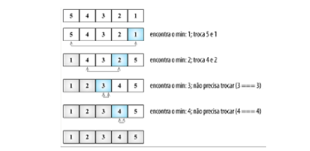
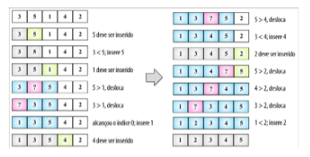
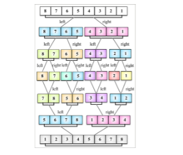

## Algoritmos de Ordenação

Os algoritmos para ordenação e buscas são amplamente utilizados nos problemas cotidianos que devamos resolver.

Serão abordados os algoritmos de ordenação e busca mais comumente usados como **bubble sort** ( ordenação por flutuação ), **selection sort** ( ordenação por seleção ), **merge sort** ( ordenação por intercalação ou mistura ), **quick sort** ( ordenação rápida ), **counting sort** ( ordenação por contagem ), **bucket sort** ( ordenação por balde ou recipiente ) e **radix sort** ( ordenação por raízes ), assim como os algoritmos de busca sequencial, por interpolação e binária.

> [Animação - Algoritmos de Ordenação e outras Estruturas de Dados](https://visualgo.net/en/)

### Bubble sort

O algoritmo de **bubble sort** ( ordenação por flutuação ) compara cada dois valores adjacentes e faz a sua troca (swap) se o primeiro valor for maior que o segundo. Ele tem esse nome porque os valores tendem a se mover para cima na ordem correta, como se fossem bolhas (bubbles) subindo para a superfície.

Nesse abordagem inicial quando o algoritmo executar a segunda passagem de comparação os números 4 e 5 já estão ordenados, ainda assim, essa comparação é realizada novamente nas outras interações, esse algoritmo pode ser melhorado evitando essas comparações necessário realizando um controle da quantidade de iteração do laço interno no algoritmo.

### Selection sort

O algoritmo **selection sort** ( ordenação por seleção ) é um algoritmo de ordenação por comparação in-place. A ideia geral por trás do selection sort é encontrar o valor mínimo na estrutura de dados, colocá-lo na primeira posição e então encontrar o segundo mínimo, colocá-lo na segunda posição, e assim sucessivamente.

### Insertion sort

O algoritmo de **insertion sort** ( ordenação por inserção ) constrói o array ordenado final, um valor de cada vez. Ele pressupõe que o primeiro elemento já esta ordenado. Então, uma comparação com o segundo valor é realizada: o segundo valor deve permanecer em seu lugar ou deverá ser inserido antes do primeiro? Os dois primeiros valores serão ordenados; em seguida, a comparação será feita com o terceiro valor ( isto é, ele deverá ser inserido na primeira, na segunda ou na terceira posição ? ), e assim sucessivamente.

### Merge sort

O algoritmo de **merge sort** ( ordenação por intercalação ou mistura ) é o primeiro algoritmo de ordenação que pode ser usado em um cenário do mundo real. Os três primeiros algoritmos de ordenação não têm bom desempenho, mas o merge sort tem, apresentando uma complexidade de O(_n log n_).

O merge sort é um algoritmo do tipo "dividir e conquistar".A ideia por trás dele é dividir o array original em arrays menores até que cada array menor tenha apenas uma posição e, em seguida, combinar esses arrays menores em arrays maiores até que tenhamos um único array grande e ordenado no final.

Por causa da abordagem de dividir e conquistar, o algoritmo de merge sort também é recursivo.

Observe que, inicialmente, o algoritmo divide o array original até que ele tenha arrays menos com um único elemento e, então,começa a combiná-los. Enquanto a combinação ocorre, a ordenação também é feita, até termos o array original totalmente recomposto e ordenado.
